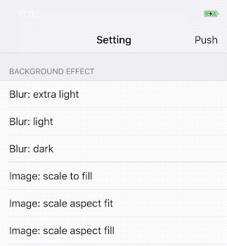
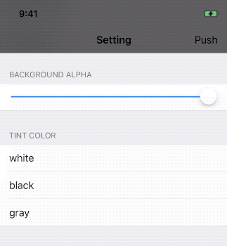
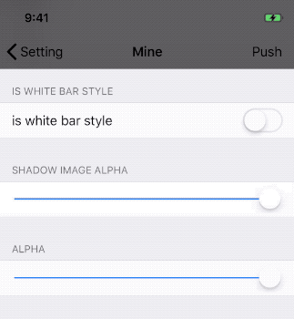
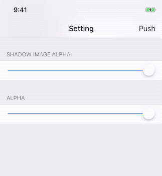
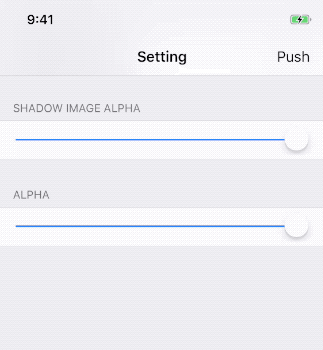

# SwiftyNavigationBar

[](https://cocoapods.org/pods/SwiftyNavigationBar)
[](https://cocoapods.org/pods/SwiftyNavigationBar)
[](https://cocoapods.org/pods/SwiftyNavigationBar)

An easy way to customizing NavigationBar.

## Requirements

-   iOS 8.0+
-   Swift 5.0

## Usage

### Installation

SwiftyNavigationBar is available through [CocoaPods](https://cocoapods.org). To install it, simply add the following line to your Podfile:

```ruby
pod 'SwiftyNavigationBar'
```

### Quick Start

首先，你需要用以下`extension`中的一个`init`来初始化`UINavigationController`:

```swift
// 1
init(preference: ((Style) -> Void)?)

// 2
init(rootViewController: UIViewController, preference: ((Style) -> Void)?)

// 3
init(viewControllers: [UIViewController], preference: ((Style) -> Void)?)

// 4
init(viewControllers: [UIViewController], toolbarClass: AnyClass?, preference: ((Style) -> Void)?)
```

```swift
let nav = UINavigationController(rootViewController: ViewController(), preference: nil)
```

>   ⚠️注意，以上`init`方法内部接管了`UINavigationController`的`delegate`，请勿再重新设置delegate。如果有需要，可以通过`nav.snb.navigationControllerDelegate`来设置delegate。

接下来，你只要需要在`UIViewController`的`viewDidLoad()`或调用更靠前的方法中做一些配置就好，这些配置项都以`snb`为前缀：

```swift
override func viewDidLoad() {
    super.viewDidLoad()
    
    self.snb.style.backgroundEffect = .color(.red)
    self.snb.style.backgroundAlpha = 0.5
    ...
}
```

当你想更新当前`NavigationBar`的样式时，需要调用`snb.updateStyle()`方法：

```swift
self.snb.updateStyle { (style) in
	style.isWhiteBarStyle = true
	style.shadowImageAlpha = 0.5
}
```

>   ⚠️这里需要注意的是，`snb.updateStyle()`只作用于`UINavigationController.topViewController`，你当前的`ViewController`在栈顶时才会起作用。

### Style

具体来说有以下样式可配置(PS: 这些GIF当中的样式都是通过`snb.updateStyle()`方法更新的)：

-   `backgroundEffect`：改变背景样式，有`Blur`/`Image`/`Color`三类样式可选

    

-   `backgroundAlpha`：改变背景透明度(并不是改变`NavigationBar`的透明度)

    

-   `tintColor`：改变`NavigationBar`的`tintColor`，主要影响左右两边`BarButtonItem`的颜色

    

-   `isWhiteBarStyle`：改变`NavigationBar`的`barStyle`，主要影响`StatusBar`和`title`

    

-   `shadowImageAlpha`：改变`shadowImage`的透明度

    

-   `alpha`：改变`NavigationBar`的透明度(这会使得整个`NavigationBar`被隐藏掉)

    

### 样式的综合使用

-   🌰#1

    

-   🌰#2

    


### 推荐用法

你并不需要在每个`UIViewController`的`viewDidLoad()`方法中都进行一番相关样式的配置。

实际上，SwiftyNavigationBar提供了3种样式配置的作用域，选择一个合适的作用域，会使配置更便捷：

-   `UIViewController`作用域：在`ViewController`中，以`snb.style`开头的相关属性配置，它只会影响当前`ViewController`的样式

    ```swift
    override func viewDidLoad() {
        ...
        self.snb.style.backgroundAlpha = /* alpha */
        ...
    }
    ```

-   `UINavigationController`作用域：会作用于`UINavigationController`中的所有`viewControllers`

    ```swift
    let nav = UINavigationController(rootViewController: ViewController(), preference: { (style) in
        // 样式配置
        style.backgroundEffect = /* effect */
        ...
    })
    ```

-   `Global`作用域：会作用于所有通过相关`init`方法初始化的`UINavigationController`。

    ```swift
    SwiftyNavigationBar.Style.backgroundEffect = /* effect */
    SwiftyNavigationBar.Style.tintColor = /* tintColor */
    SwiftyNavigationBar.Style.alpha = /* alpha */
    ```

他们的优先级是：`UIViewController`作用域 > `UINavigationController`作用域 > `Global`作用域

其中`Global`作用域有默认值，也就是说，`UINavigationController`作用域/`UIViewController`作用域可以不用配置或只配置一部分样式，剩下的样式配置使用`Global`作用域的配置即可。

所以一个比较推荐的用法如下：

```swift
// 第一步，配置Global作用域
SwiftyNavigationBar.Style.backgroundEffect = /* effect */

// 第二步，配置UINavigationController作用域
let nav1 = UINavigationController(rootViewController: ViewController(), preference: { (style) in
    style.backgroundEffect = /* effect */
    style.tintColor = /* tintColor */
})

let nav2 = UINavigationController(rootViewController: ViewController(), preference: nil)
nav2.snb.navigationControllerDelegate = self /* 等价于nav.delegate = self */

// 第三步，配置UIViewController作用域
override func viewDidLoad() {
    ...
    self.snb.style.backgroundAlpha = /* alpha */
    ...
}
```

## Author

wlgemini, wangluguang@live.com

## License

SwiftyNavigationBar is available under the MIT license. See the LICENSE file for more info.
